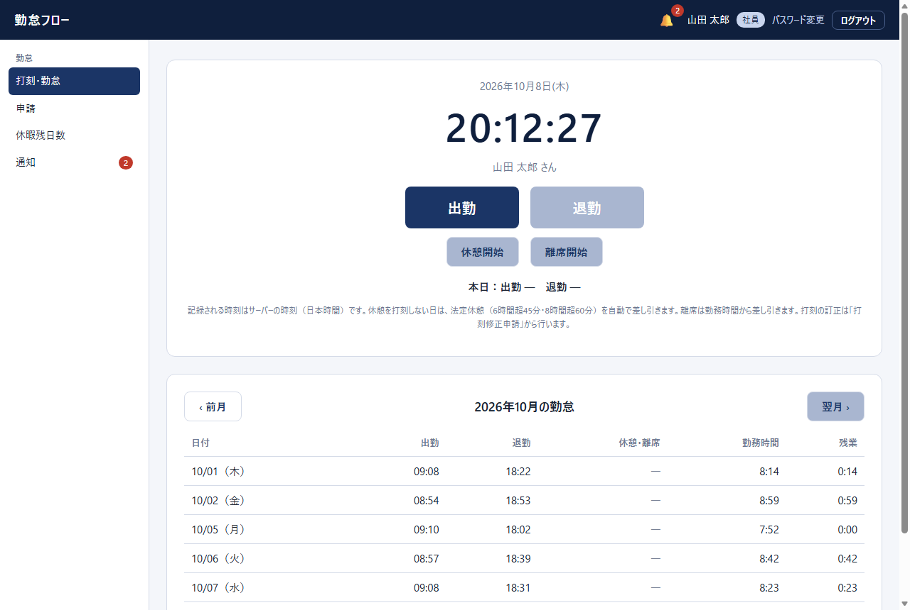
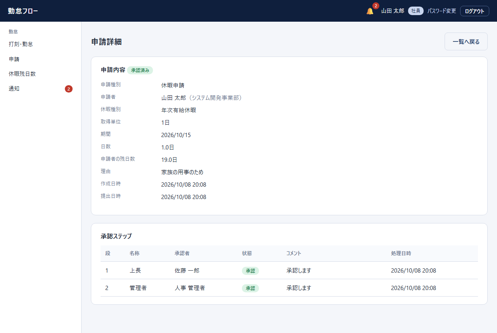
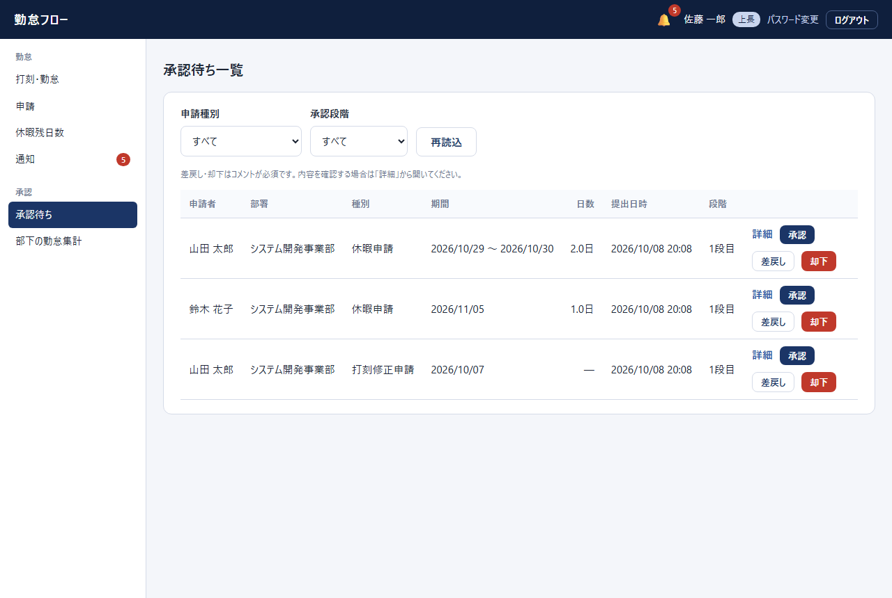
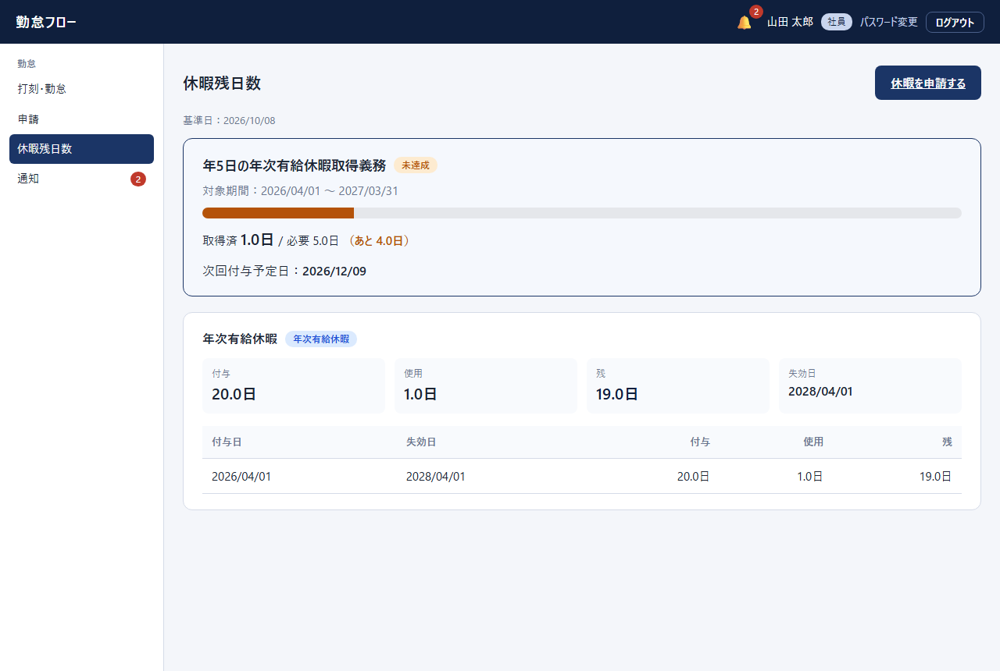
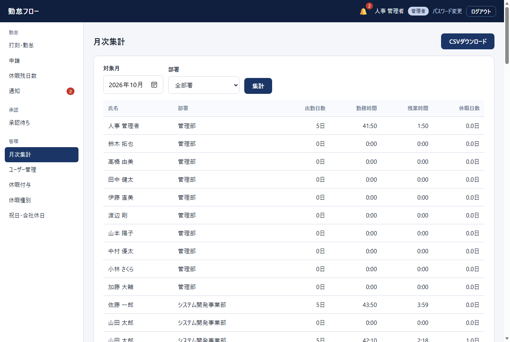
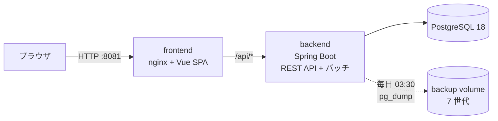
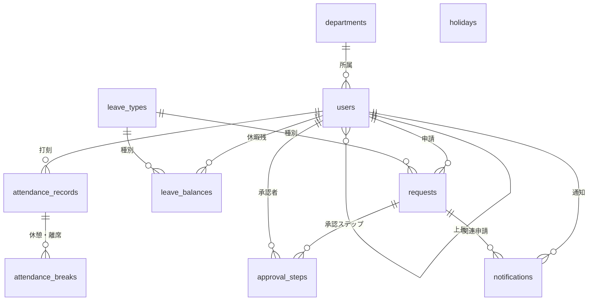
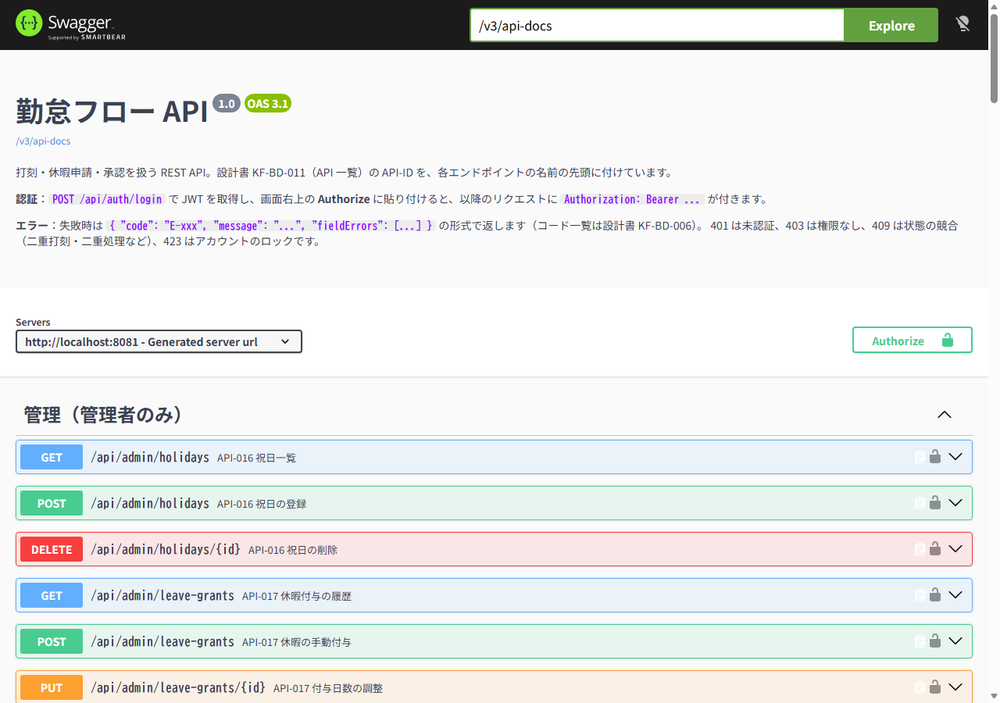
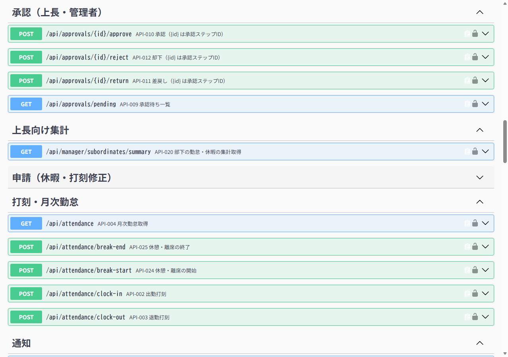

# 勤怠フロー（KintaiFlow）

[](https://github.com/ms13684543858-sys/KintaiFlow/actions/workflows/ci.yml)

打刻・休暇申請・承認を一つにまとめた、勤怠管理 Web アプリケーションです。
要件定義 → 基本設計 → 詳細設計 → 実装 → テストと、**和式ウォーターフォールの工程を一通り通して**作りました（AI の支援を受けた開発です。詳細は「開発の進め方」参照）。

> **English summary** — KintaiFlow is a full-stack attendance & leave management system (Spring Boot 4 / Java 21, Vue 3, PostgreSQL 18).
> It covers clock-in/out with breaks, leave requests with two-step approval, annual-leave balances with automatic statutory grants,
> scheduled batch jobs, and a Dockerized one-command demo. It was built through a full Japanese-style waterfall process, and the
> 86 design documents (Excel, in Japanese) are included. Try it: `docker compose --env-file .env.demo up -d --build`, then open <http://localhost:8081>.



## まず触ってみる（Docker で 1 コマンド）

必要なもの：Docker（Docker Desktop 等）。メモリは 4GB 程度あると安心です。

```bash
git clone https://github.com/ms13684543858-sys/KintaiFlow.git
cd KintaiFlow
docker compose --env-file .env.demo up -d --build
```

初回のビルドは数分かかります。完了したら <http://localhost:8081> を開いてください。
デモ用のユーザー・出勤記録・状態の異なる申請が自動で入ります。

| 役割 | メールアドレス | 備考 |
|---|---|---|
| 社員 | `taro@example.com`（山田 太郎）／ `hanako@example.com`（鈴木 花子） | 打刻・申請 |
| 上長 | `manager@example.com`（佐藤 一郎） | 部下の申請を承認 |
| 管理者 | `admin@example.com` | 最終承認・ユーザー／休暇／祝日の管理・月次集計 |

パスワードは全員 `Demo-Pass-2026` です（`.env.demo` に書いてある、**公開前提の使い捨ての値**。本番では絶対に使わないでください）。

**試し方の例**：上長でログイン →「承認待ち」で山田 太郎の年休申請を承認 → ログアウトして管理者でログイン → 最終承認 → 山田 太郎でログインして「申請」「休暇残日数」を確認。

```bash
docker compose --env-file .env.demo down        # 停止（データは残る）
docker compose --env-file .env.demo down -v     # 停止してデータも削除（初期状態に戻す）
```

## 主な機能

| 区分 | 機能 |
|---|---|
| 社員 | 出勤・退勤の打刻、休憩／離席の記録、月次勤怠の一覧、休暇申請（全日・半日）、打刻修正申請、休憩・離席の修正申請、休暇残日数、通知 |
| 上長 | 部下の申請の承認・差戻し・却下、部下の勤怠・休暇の集計 |
| 管理者 | 最終承認、ユーザー管理、休暇種別・祝日・休暇付与の管理、全社の月次集計 |
| 自動処理 | 年次有給休暇の自動付与、年 5 日取得義務のアラート、DB バックアップ（下の「バッチ」参照） |

<table>
<tr>
<td width="50%"><br><sub>申請詳細と承認ステップ（上長 → 管理者の 2 段階）</sub></td>
<td width="50%"><br><sub>上長の承認待ち一覧</sub></td>
</tr>
<tr>
<td><br><sub>休暇残日数と年 5 日取得義務の進捗</sub></td>
<td><br><sub>管理者の月次集計</sub></td>
</tr>
</table>

そのほかの画面：[申請一覧](docs/images/03-requests.png) ／ [部下の勤怠集計](docs/images/07-manager-summary.png) ／ [ユーザー管理](docs/images/09-admin-users.png)

## 技術スタック

| 層 | 使用技術 |
|---|---|
| バックエンド | Java 21、Spring Boot 4.1.1（Web MVC / Security / Data JPA / Validation / Actuator）、JWT（ステートレス認証） |
| フロントエンド | Vue 3、Vue Router、Vite |
| データベース | PostgreSQL 18、Flyway（スキーマのバージョン管理。JPA は `validate` で定義との一致だけ検査） |
| 実行環境 | Docker / Docker Compose、nginx（画面の配信と `/api` の中継） |
| CI | GitHub Actions（バックエンドのテストは Testcontainers の使い捨て PostgreSQL 上で実行、フロントエンドはビルド検証） |
| テスト | JUnit 5、Mockito、Testcontainers、MockMvc（バックエンド 149 件。うち API の結合テスト 37 件） |

### 構成



画面と API は nginx 経由で**同一オリジン**になるため、本番では CORS の設定が不要です。

### データモデル（10 テーブル）



## API ドキュメント

38 のエンドポイントを、設計書 [KF-BD-011（API 一覧）](docs/02_基本設計/04_API・外部IF) の **API-ID 付き**で、OpenAPI 3.1 / Swagger UI として公開しています。デモ環境（上の `.env.demo`）では次の URL で見られます。

- Swagger UI：<http://localhost:8081/swagger-ui.html>（右上の **Authorize** に、`POST /api/auth/login` で取った JWT を貼ると、画面から API を試せます）
- 仕様書（JSON）：[`docs/api/openapi.json`](docs/api/openapi.json)

<table>
<tr>
<td width="50%"><br><sub>Swagger UI（認証方法とエラー形式の説明つき）</sub></td>
<td width="50%"><br><sub>エンドポイントは機能ごとにグループ化し、API-ID を付けている</sub></td>
</tr>
</table>

- **本番では公開しません**：`kintaiflow.api-docs.enabled`（環境変数 `API_DOCS_ENABLED`）の既定は `false` で、無効のときは `/swagger-ui.html` も `/v3/api-docs` も 404 です（テストで確認）。
- **仕様書とコードの同期をテストで保証**しています。エンドポイントを足して説明（`OpenApiConfig`）を書き忘れると、またはコードを変えて `openapi.json` を更新し忘れると、テストが失敗します。更新は `cd backend && ./mvnw test -Dtest=ApiDocsIT -Dopenapi.update=true`。

## バッチ

Spring の `@Scheduled` で実装しています（設計書：[KF-DD-004](docs/03_詳細設計/02_バッチ設計)）。

| ID | 内容 | 実行契機（JST） |
|---|---|---|
| BAT-001 | 年次有給休暇の自動付与（入社 6 か月後、以降 1 年ごと。勤続年数に応じた法定日数） | 毎日 02:00 |
| BAT-002 | 年 5 日取得義務アラート（付与 10 日以上で取得 5 日未満の人を、本人と管理者へ通知） | 毎月 1 日 03:00 |
| BAT-003 | DB バックアップ（`pg_dump`、7 世代） | 毎日 03:30 |

設計上のポイント：
- **冪等**：何度実行しても二重付与・二重通知になりません。判定は DB の一意制約でも最終防衛しています。
- **1 件ごとに独立したトランザクション**（`REQUIRES_NEW`）：1 件の失敗が他に影響せず、集計して終了コード（0 正常 / 1 一部失敗 / 2 異常）を返します。
- **取りこぼし救済**：停止中に応当日を過ぎても、直近 7 日分は次回の実行で付与します。
- **バックアップは一時ファイル → 検証 → 原子的に移動**：途中で切れたダンプを世代に入れず、失敗したときは古い世代を消しません。パスワードは環境変数でだけ `pg_dump` に渡します。

手動で 1 回だけ実行できます（管理 API は設けていません）。

```bash
cd backend
./mvnw spring-boot:run -Dspring-boot.run.arguments="--kintaiflow.batch.run-once=BAT-001 --kintaiflow.batch.scheduling-enabled=false --server.port=0"
```

`--kintaiflow.batch.target-date=yyyy-MM-dd` で基準日を指定できます。BAT-003 には `pg_dump`（PostgreSQL 18 以上のクライアント）が必要です（Docker のイメージには同梱）。
復元は `psql -f backup/kintai_yyyyMMdd.sql <DB名>` です。

## ローカルで開発する

必要なもの：JDK 21、Node.js 24、PostgreSQL 18。

1. DB `kintaiflow` を作ります（既定のユーザーは `postgres`）。
2. `backend/src/main/resources/application-local.properties`（Git 管理外）を作り、次を書きます。
   ```properties
   spring.datasource.password=（DB のパスワード）
   kintaiflow.jwt.secret=（32 バイト以上の乱数を base64 にした文字列）
   # デモと同じダミーデータを入れたいとき
   kintaiflow.dev.seed-enabled=true
   kintaiflow.dev.seed-password=（ダミーユーザー共通のパスワード）
   ```
3. バックエンド：`cd backend && ./mvnw spring-boot:run`（<http://localhost:8080>。テーブルは Flyway が作ります）
4. フロントエンド：`cd frontend && npm ci && npm run dev`（<http://localhost:5173>。`/api` は 8080 へ中継されます）
5. テスト：`cd backend && ./mvnw test`（結合テストは Docker で使い捨ての PostgreSQL を起動します。Docker が動いていないと結合テストはスキップされます。開発用 DB には触りません）

本番用の設定は `.env.example` をコピーして `.env` を作ります（DB パスワード・JWT 鍵は長いランダムな値にする）。`.env` は Git に入れません。

## テスト

バックエンドは **149 件**（`./mvnw test`）。ロジックの単体テストに加えて、**実際の Spring コンテキスト（セキュリティ設定・Flyway・JPA）を使い捨ての PostgreSQL に対して動かす結合テスト**があります。

| 区分 | 内容 |
|---|---|
| 認証・認可（13 件） | 未ログインと改ざんトークンの拒否、ロール別アクセス（社員・上長・管理者）、ログイン失敗 5 回でロック、メールの正規化、初期パスワードのまま使えないこと、パスワード変更後に古いトークンが失効すること、API ドキュメントが既定では公開されないこと |
| 休暇申請と承認（12 件） | 申請 → 上長 → 管理者の 2 段階承認と残日数の更新、差戻し・却下はコメント必須、他人の申請を見られない・承認できない、自分の申請は承認できない、二重処理の防止、期間の重複・残日数不足・日付の逆転の拒否、半日休 |
| 打刻（8 件） | 二重打刻・出勤前の退勤・休憩中の退勤など不正な状態遷移の拒否、記録が本人にだけ見えること |
| API ドキュメント（4 件） | 有効にしたときだけ公開される、コードにある全エンドポイントが設計書の API-ID 付きで文書化されている、提出済みの仕様書 `docs/api/openapi.json` が現在のコードと一致する（古くなると失敗） |
| 単体テスト | 年休の付与日数と応当日（月末・うるう日）、勤務時間の計算、バッチの判定、バックアップの世代管理 など |

権限のテストが本当に効いているかは、検査をわざと外して確認しました（例：承認者の確認を外すと該当テストだけが失敗する）。

## 設計書（docs/）

86 本の設計書（Excel）と要件定義書（PDF）を、実装と同期した状態で置いています。

| フォルダ | 内容 |
|---|---|
| `01_要件定義` | 要件定義書 |
| `02_基本設計` | 機能・画面一覧、画面設計書、データ設計、API・外部 IF、権限・メッセージ・帳票、バッチ（基本）、非機能 |
| `03_詳細設計` | オンライン処理の詳細設計（1 処理 1 ファイル）、バッチ、テーブル、クラス・内部 IF、開発規約 |

テスト仕様書（`04_テスト`）はまだ作っていません。

## 開発の進め方

- 工程は **設計書 → コード → テスト** の順で、変更も設計書から反映する運用にしています（ID 体系：`ONL-` オンライン、`BAT-` バッチ、`SCR-` 画面、`TBL-` テーブル）。
- 設計書と実装は、AI（Claude）の支援を受けて進めました。後半のコミットには `Co-Authored-By` を付けています。
- 実装した機能は、設計書との突き合わせと、Docker 上での実動作確認（各ロールでのログイン・申請・承認・バッチ・バックアップと復元）で検証しています。

## 既知の制限・今後の課題

学習・ポートフォリオ用のため、実運用には次が足りません。

- HTTPS（TLS）の終端は未設定です（本番はロードバランサやリバースプロキシで終端する想定）。
- 監査ログ、案件（客先）管理、月次締め、時間外労働の上限アラートは未実装です。
- 画面を通した E2E テストと、フロントエンドのテストは未整備です（バックエンドは単体テストと API の結合テストがあります）。
- ログイン後のトークンはブラウザの `localStorage` に保存しています（有効期限は 2 時間）。
- バッチは単一インスタンス前提です（複数台にする場合は ShedLock 等で排他する）。
- バックアップは同一ホスト内です。別拠点（オフサイト）への保存や暗号化は運用側で行う前提です。
